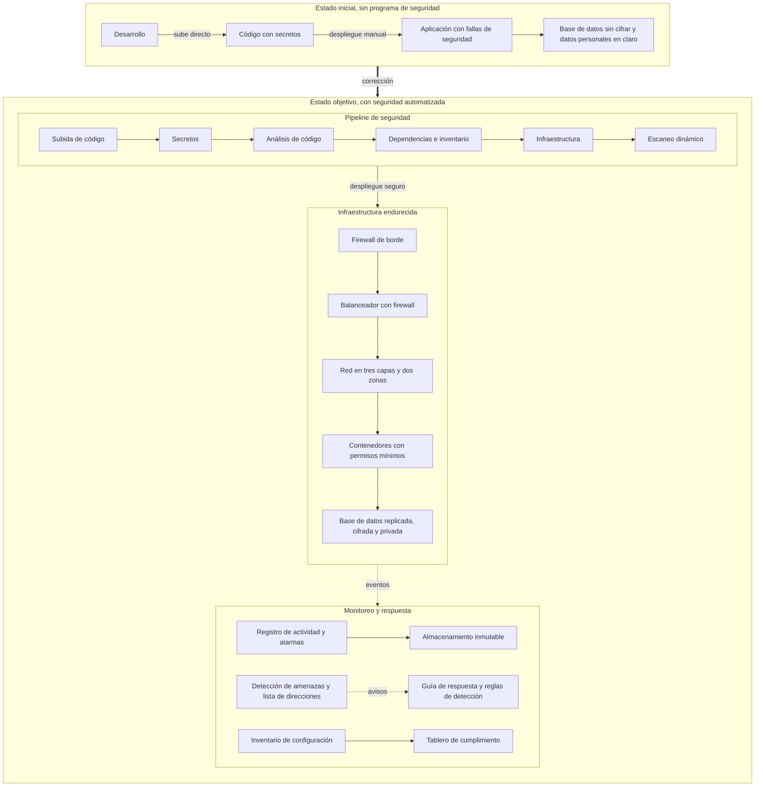

# FleetSec S.A.S. - Prueba técnica de Ingeniero de Ciberseguridad

Implementación completa de los cuatro entregables: un pipeline de seguridad
que funciona, el análisis y la corrección de 10 vulnerabilidades, el
endurecimiento de la infraestructura en la nube con código y la detección y
respuesta a incidentes. El repositorio está pensado para ser reproducible: cada
control tiene su evidencia y las versiones vulnerables se conservan aparte para
poder comparar el antes y el después.

> Enlace al video de sustentación: https://youtu.be/Fwv4ivvRyHs

---

## 1. Cómo levantar y probar el proyecto

### Opción rápida con un solo comando

```bash
cd app
JWT_SECRET=$(openssl rand -hex 24) docker compose up -d --build
curl http://localhost:3000/
```

### Ejecución local con Node

```bash
cd app
npm ci
JWT_SECRET=un_secreto_seguro node server.js
```

### Reproducir el análisis de vulnerabilidades

```bash
# Comprobar las correcciones: el ataque queda bloqueado y el uso normal funciona
BASE=http://localhost:3000 bash vapt/tests/run_validation.sh

# Reproducir los ataques contra la versión vulnerable de referencia
BASE=http://localhost:3000 bash vapt/poc/run_all_pocs.sh
```

### Revisar la infraestructura sin una cuenta de nube

```bash
cd infrastructure
terraform init -backend=false
terraform validate
checkov -d .
```

---

## 2. Arquitectura de seguridad, del estado inicial al objetivo



---

## 3. Tabla de cumplimiento

| # | Control aplicado | CIS AWS | ISO 27001 | Ley 1581 | Estado |
|---|------------------|:-------:|:---------:|:--------:|:------:|
| 1 | Política de contraseñas de 14 caracteres, cambio cada 90 días y sin repetir las últimas 24 | 1.8 a 1.11 | A.5.17 | Art. 19 | Cumple |
| 2 | Vigilancia del segundo factor de la cuenta raíz | 1.5 | A.5.17 | Art. 19 | Cumple |
| 3 | Cifrado de la base de datos con clave dedicada | 2.3.1 | A.8.24 | Art. 19 | Cumple |
| 4 | Bloqueo de acceso público al almacenamiento en toda la cuenta | 2.1.5 | A.8.3 | Art. 19 | Cumple |
| 5 | Registro de actividad en todas las regiones con validación de integridad | 3.1 y 3.2 | A.8.15 | No aplica | Cumple |
| 6 | Retención de registros que no admite cambios | 3.6 | A.8.16 | Art. 19 | Cumple |
| 7 | Alarmas sobre eventos sensibles | 4.x | A.8.16 | No aplica | Cumple |
| 8 | Grupo de seguridad por defecto cerrado | 5.3 | A.8.20 | No aplica | Cumple |
| 9 | Detección de amenazas con lista de direcciones maliciosas | 4.3 | A.8.16 | No aplica | Cumple |
| 10 | Firewall de aplicaciones con bloqueo de inyección, límite de intentos y filtro por país | No aplica | A.8.20 | No aplica | Cumple |
| 11 | Clave de cifrado por servicio con rotación anual | 3.7 | A.8.24 | Art. 19 | Cumple |
| 12 | Credencial de base de datos en el gestor de secretos con cambio cada 30 días | 1.x | A.8.24 | Art. 19 | Cumple |
| 13 | Enmascarado de datos personales en los registros | No aplica | A.8.11 | Art. 4 y 17 | Cumple |

---

## 4. Pipeline de seguridad

Seis etapas que corren en paralelo dentro de `.github/workflows/devsecops.yml`:

| Etapa | Herramienta | Punto de control |
|-------|-------------|------------------|
| Secretos | Gitleaks con reglas propias | cualquier secreto detiene la integración |
| Análisis de código | Semgrep con reglas oficiales y propias | ningún hallazgo alto o crítico |
| Dependencias e inventario | Trivy | fallas altas o críticas detienen y se genera el inventario |
| Contenedor e infraestructura | Hadolint, Trivy y Checkov | imagen sin versión fija, fallas críticas o puertos abiertos detienen |
| Escaneo dinámico | OWASP ZAP con sesión iniciada | los hallazgos altos detienen y los medios abren un caso |

Para mantener la ejecución por debajo de 15 minutos, las etapas corren en
paralelo, se cancela la ejecución anterior de la misma rama, se guarda en caché
la instalación de las herramientas, cada escáner revisa solo su carpeta
dejando fuera la versión de referencia, y las acciones de terceros se fijan por
versión exacta.

Acceso de emergencia. El acceso a la rama principal exige dos aprobaciones a
través de la lista de propietarios del código. La excepción urgente se activa a
mano y abre de forma automática un caso crítico con el registro de quién la
pidió, cuándo y por qué.

Revisión de secretos en local. El archivo `.pre-commit-config.yaml` ejecuta el
detector de secretos en cada commit, con lo que repite el control del pipeline
antes de subir el código.

---

## 5. Decisiones de diseño

- Versión vulnerable aparte. En lugar de borrar el código vulnerable tras
  corregirlo, se conserva en una carpeta que el pipeline ignora. La razón es la
  trazabilidad: permite reproducir los ataques y comparar el antes y el después
  sin que los hallazgos vuelvan a aparecer en el análisis.
- Peticiones salientes por lista cerrada. El usuario elige una opción de una
  lista y la dirección consultada es siempre una constante del servidor. La
  razón es que así se elimina de raíz la posibilidad de desviar la petición
  hacia un destino interno.
- Cambio del lector de XML y de la base de datos. Se migró al lector mantenido y
  a una versión de base de datos sin la cadena de dependencias con fallas. La
  razón es dejar la revisión de dependencias sin hallazgos.
- Endurecimiento del contenedor. Versión fija de la imagen, sin herramientas de
  construcción, sin privilegios y con los parches del sistema. La razón es
  reducir la superficie de ataque y pasar los controles del pipeline.
- Firewall genérico en observación. El conjunto genérico de reglas del firewall
  se deja midiendo antes de bloquear. La razón es conocer cuántas peticiones
  legítimas afectaría antes de activarlo, mientras las reglas de inyección sí
  bloquean desde el principio.
- El análisis de código solo detiene ante hallazgos altos. La razón es cumplir
  el requisito sin frenar la entrega por avisos de menor gravedad, que quedan
  como información para revisar.

---

## 6. Uso de inteligencia artificial

Se usó inteligencia artificial como herramienta de apoyo, no como autor del trabajo.
En concreto sirvió para dar forma a los reportes ejecutivos y dejarlos más concisos,
para mejorar la redacción de la documentación y de los comentarios del código, y como
ayuda para revisar y encontrar problemas dentro del pipeline a partir de los mensajes
de las ejecuciones. Las decisiones de seguridad, la elección de los controles y la
comprobación de los mismos fueron realizadas con base a conocimientos propios,
investigación y documentación de IAC, principios de mejor privilegio, mejores
prácticas e infraestructura segura declarados en la ISO 27001, Owasp, AWS, Ley 1581,
CIS y NIST.

Tareas que no delegaría sin supervisión. No dejaría sin revisión humana la
aprobación final de los permisos y de las reglas de red, porque un error abre la
organización entera. Tampoco la ejecución de acciones de respuesta en
producción, como aislar o eliminar recursos, porque un falso positivo puede
tumbar un servicio y causar más daño que el propio incidente. Tampoco la
decisión de descartar un hallazgo de un escáner, que exige entender el contexto
del negocio, ni el manejo de secretos y datos personales reales. La inteligencia
artificial acelera el análisis y la redacción, pero el criterio de riesgo, la
responsabilidad legal y las acciones que no se pueden deshacer quedan en manos
de la persona.

---

## 7. Estructura del repositorio

```
.
├── .github/workflows/     flujo del pipeline y del acceso de emergencia
├── .github/CODEOWNERS      propietarios del código con doble aprobación
├── .semgrep/               reglas propias de análisis de código
├── .gitleaks.toml          configuración del detector de secretos
├── .pre-commit-config.yaml revisión de secretos antes de cada commit
├── .zap/rules.tsv          ajuste del escaneo dinámico
├── app/                    aplicación corregida que analiza el pipeline
├── _vulnerable_baseline/   versión vulnerable de referencia, ignorada por el pipeline
├── infrastructure/         infraestructura como código y sus evidencias
├── incident_response/      indicadores, guía de respuesta y reglas de detección
└── vapt/                   reporte de vulnerabilidades, pruebas y reporte ejecutivo
```

---

## 8. Dificultades y próximos pasos

Dificultades encontradas. Ajustar las reglas propias de análisis para que
detecten la versión vulnerable sin marcar la corregida. Lograr que el escáner
dinámico alcanzara la aplicación dentro del entorno de integración, resuelto
haciéndolo correr en la misma red. Y sortear las dependencias frágiles de
algunas herramientas de terceros, resuelto ejecutándolas desde su imagen
oficial.

Próximos pasos. Exigir el segundo factor por usuario, que hoy solo se vigila.
Filtrar el tráfico de salida de la red y admitir solo imágenes del repositorio
privado. Desplegar las reglas de detección en un sistema de monitoreo con sus
alertas. Y firmar las imágenes del contenedor para poder verificar su
procedencia.
